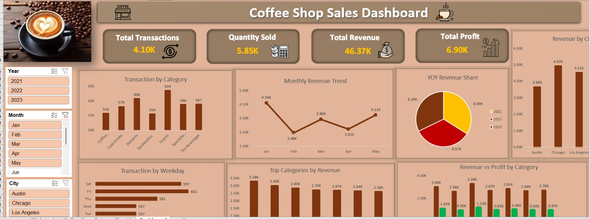
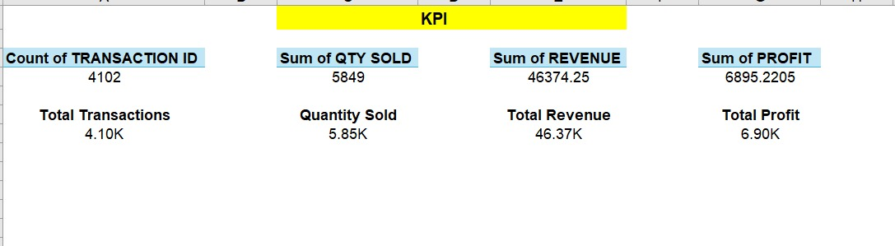
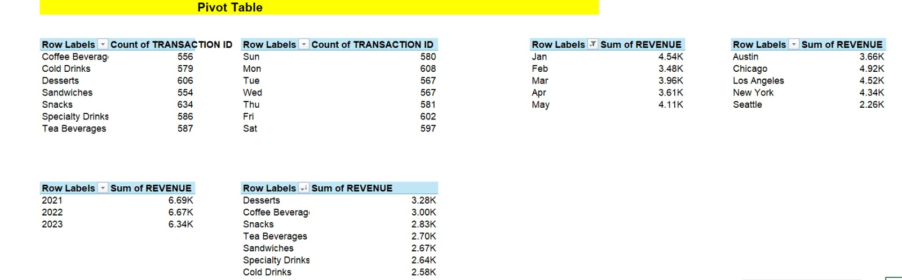

# ☕ Coffee Shop Sales Analysis

A comprehensive data analysis project exploring retail coffee shop sales using Microsoft Excel. This project transforms raw transactional data into actionable business insights, tracking performance through calculated KPIs, Pivot Tables, and a final visual Dashboard.

## 📁 Project Files & Structure

* **Raw Data (`Coffee_Shop_Analysis.xlsx - Coffee Shop Data.csv`):** The foundational dataset containing transaction details, product categories, quantities, and pricing.
* **Pivot Table Analysis:** Grouping and summarizing the raw data to uncover trends across different time periods, products, and store locations.
* **KPI Tracking:** Measurement of critical business health indicators.
* **Interactive Dashboard:** A consolidated visual report designed for stakeholders to quickly grasp performance metrics.

---

## 📊 Visual Overview

### 1. Final Dashboard
The primary dashboard providing a high-level view of sales trends, peak hours, and top-performing products.

### 2. Key Performance Indicators (KPIs)
A focused look at the core metrics driving the business (e.g., Total Sales, Total Orders, Average Order Value).

### 3. Data Aggregation (Pivot Tables)
The backend analysis utilizing Excel Pivot Tables to slice and dice the dataset before visualization.

---

## 🛠️ Tools & Techniques Used
* **Microsoft Excel:** Primary tool for the entire workflow.
* **Data Cleaning & Formatting:** Ensuring data accuracy for reliable reporting.
* **Pivot Tables & Pivot Charts:** For dynamic data aggregation and exploration.
* **Data Visualization:** Creating bar charts, line graphs, and KPI cards.
* **Dashboard Design:** Organizing insights logically for end-user consumption.

## 🚀 How to View the Project
1. Clone this repository: `git clone https://github.com/YourUsername/Your-Repo-Name.git` *(Update with your actual repo link)*
2. Download the `Coffee_Shop_Analysis.xlsx` file.
3. Open it in Microsoft Excel.
4. Navigate through the tabs to view the Raw Data, Pivot Tables, and interact with the final Dashboard!